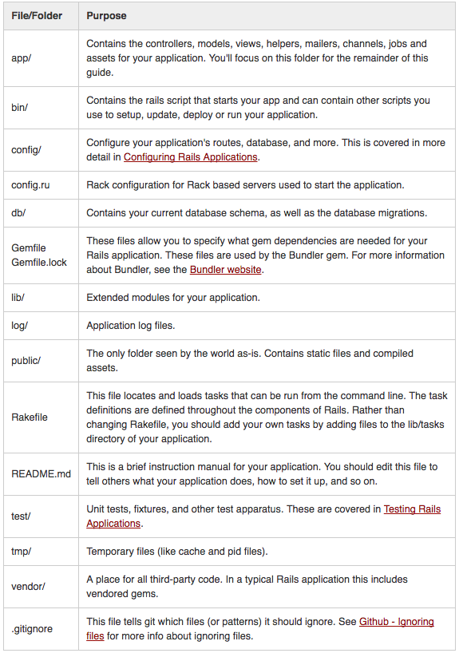
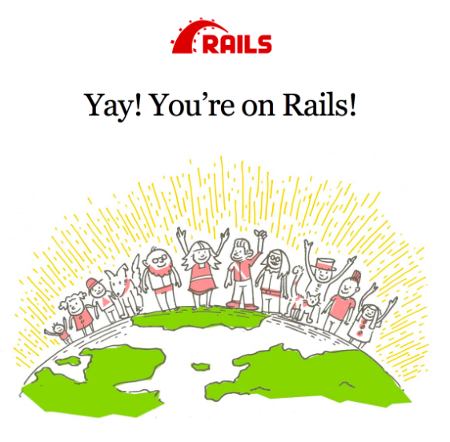
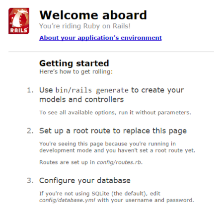

# Server Side Crud
## Learn a new Language
You will teach yourself a new server side language/web framework and build a RESTful CRUD JSON API in said language/framework.
* - [x] Get language and framework approved by an instructor

* - [x] Choose your language: **Ruby**, framework: **Rails**

- [...] **Write/Compile/Run Hello World in a new Language**

- [ ] **Implement a RESTful CRUD JSON API in a new Language**

## Steps to CRUD in a new Language / Framework
- [x] Choose a Language (Any server side language except JavaScript)

  - [...] Setup Development Environment
  - [...] Write / Compile / Run Hello World

- [x] Choose a Server Side Web Framework
  * [Web Application Frameworks](https://github.com/showcases/web-application-frameworks?s=stars)

  * [Hot Frameworks](http://hotframeworks.com/)

  * [Languages and Frameworks you should learn in 2016](https://tutorialzine.com/2015/12/the-languages-and-frameworks-you-should-learn-in-2016)

- [ ] Create a RESTful CRUD JSON API using a framework in chosen language

  - [ ] Complete a tutorial on a given language/framework that creates a RESTful CRUD JSON API

  - [ ] Data must be stored in a database of some kind
        *can be anything: MySQL, Postgres, Mongo, etc*

  - [ ] API must return JSON

  - [ ] Create a repo, push to Github, and submit to learn

[CJ's tips](https://gist.github.com/w3cj/de4982a126ea52b3df326660a240ad7e)

# Build a Server with Ruby on Rails

Install Ruby Version Manager (RVM)
*RVM is a command-line tool which allows you to easily install, manage, and work with multiple ruby environments from interpreters to sets of gems.*
```
$ \curl -sSL https://get.rvm.io | bash -s stable
```
**Ruby will automatically use bash to store the configuration information.**
If you are using Zsh or anything other than Bash, copy and paste the information from the bash.rc and bash-profile into the zsh.rc

Load RVM into your shell sessions as a function
```
$ source ~/.rvm/scripts/rvm

$ rvm user gemsets
```

Test - should return rvm is a function
```
$ type rvm | head -n 1
```

Install [Ruby](https://rubygems.org/)
```
$ rvm install 2.1.1
```
or, install latest stable version of ruby
```
$ rvm install ruby --latest
```

Install [Rails](http://guides.rubyonrails.org/getting_started.html)
```
$ gem install rails -v 4.1.8
```
to test the version
```
$ rails -v
```

Install [Bundler](http://bundler.io/)
```
$ gem install bundler
```

*if you run $ bundle and get:*
```
> Can't install RMagick 0.0.0. Can't find Magick-config . . .
```
 install the Image Magick dependency
 ```
 $ brew install imagemagick
 ```

 Setup Resources:

 [Rails Install](https://gist.github.com/berto/f4ac7d47d48c568490c8)

 [RVM CLI Usage](http://rvm.io/rvm/cli)

 [Building Your First Rails App](https://www.sitepoint.com/building-your-first-rails-application-models/)

# Structure of a Rails Application

You can see all of the command line options that the Rails application builder accepts by running:
```
$ rails new -h.
```

## [Blog](http://guides.rubyonrails.org/getting_started.html) Application Example

**Creating the App:**

Rails comes with a number of scripts called generators that are designed to make your development life easier by creating everything that's necessary to start working on a particular task. One of these is the new application generator, which will provide you with the foundation of a fresh Rails application so that you don't have to write it yourself.

```
$ rails new blog
```
This will create a Rails application called Blog in a blog directory and install the gem dependencies that are already mentioned in Gemfile using bundle install.

After you create the blog app, switch into its folder:
```
$ cd blog
```

The blog directory has a number of auto-generated files and folders that make up the structure of a Rails application.





**Starting up the Server:**

Run the following in the blog directory:
```
$ bin/rails server
```

open a browser window and navigate to http://localhost:3000





To stop running the server, just use Ctrl C.

**'Hello World':**

Create at minimum a controller and a view:
  * A controller's purpose is to receive specific requests for the application. Routing decides which controller receives which requests. Often, there is more than one route to each controller, and different routes can be served by different actions. Each action's purpose is to collect information to provide it to a view. It is the controller, not the view, where information is collected.

  * A view's purpose is to display this information in a human readable format and display that information.

To create a new controller:

 * Run the "controller" generator and tell it you want a controller called "Welcome" with an action called "index":
 ```
 $ bin/rails generate controller Welcome index
 ```

 * Rails will create several files and a route
 ```
 create  app/controllers/welcome_controller.rb
 route  get 'welcome/index'
invoke  erb
create    app/views/welcome
create    app/views/welcome/index.html.erb
invoke  test_unit
create    test/controllers/welcome_controller_test.rb
invoke  helper
create    app/helpers/welcome_helper.rb
invoke    test_unit
invoke  assets
invoke    coffee
create      app/assets/javascripts/welcome.coffee
invoke    scss
create      app/assets/stylesheets/welcome.scss
```

* the controller is located at *app/controllers/welcome_controller.rb* and the view is located at *app/views/welcome/index.html.erb*.

* Open the view file and delete all of the existing code in the file, and replace it with:
```
<h1>Hello World!</h1>
```

**Setting the Application's Home Page**
After the controller and view are established, we need to tell Rails when we want "Hello World!" to display at the root URL of our site, http://localhost:3000. At the moment, "Welcome aboard" is occupying that spot.



You have to tell Rails where your actual home page is located.
* Open the file config/routes.rb in your editor:
```
Rails.application.routes.draw do
  get 'welcome/index'
```

This is routing file which holds entries in a domain-specific language that tells Rails how to connect incoming requests to controllers and actions.
* Edit this file:
```
Rails.application.routes.draw do
  get 'welcome/index'

  root 'welcome#index'
end
```

* *root 'welcome#index'* tells Rails to map requests to the root of the application to the welcome controller's index action and *get 'welcome/index'* tells Rails to map requests to http://localhost:3000/welcome/index to the welcome controller's index action.
[This was created earlier when you ran the controller generator (bin/rails generate controller Welcome index).]

Navigate to http://localhost:3000 in your browser. You'll see the "Hello, World!" message you put into app/views/welcome/index.html.erb, indicating that this new route is indeed going to WelcomeController's index action and is rendering the view correctly.
